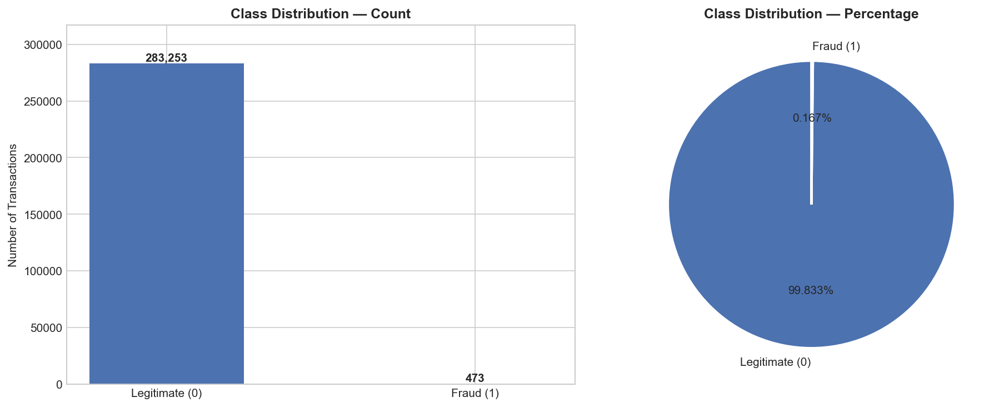
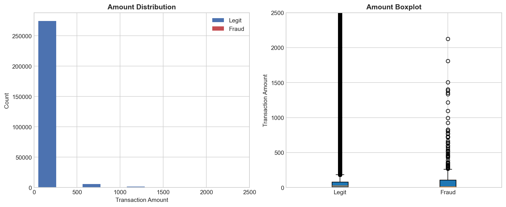
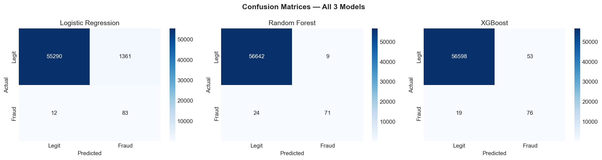
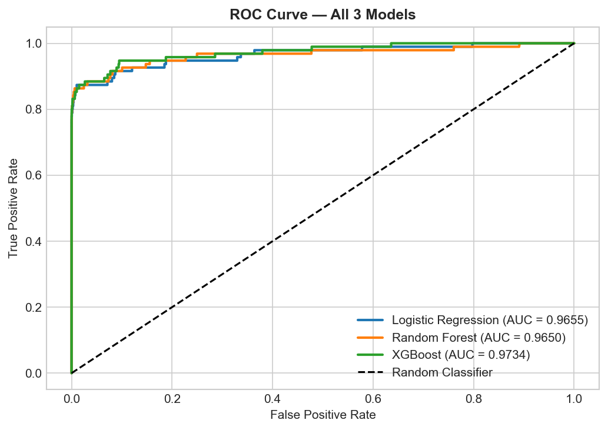
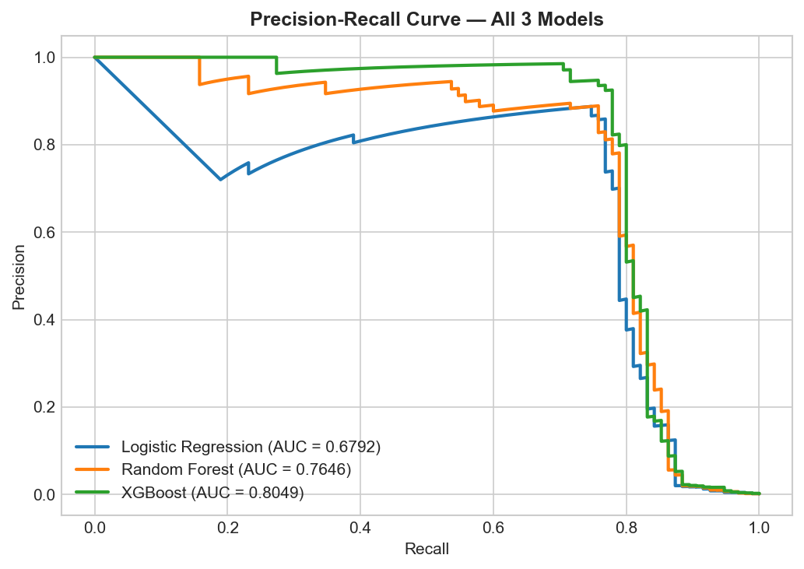
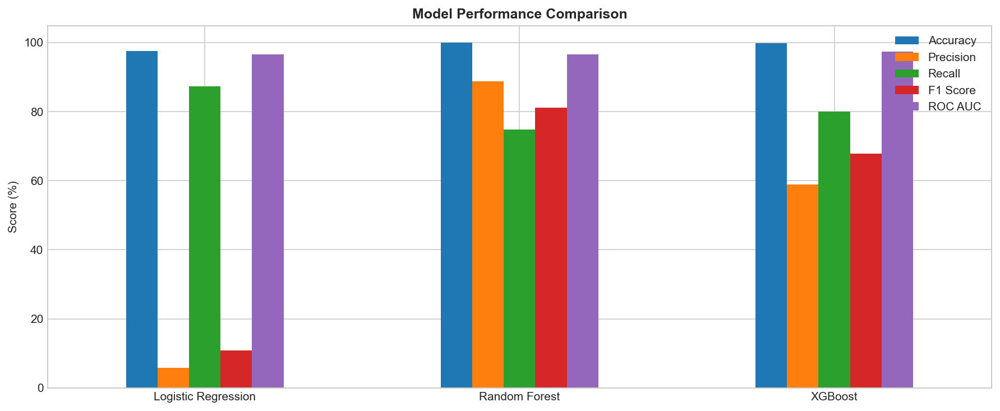
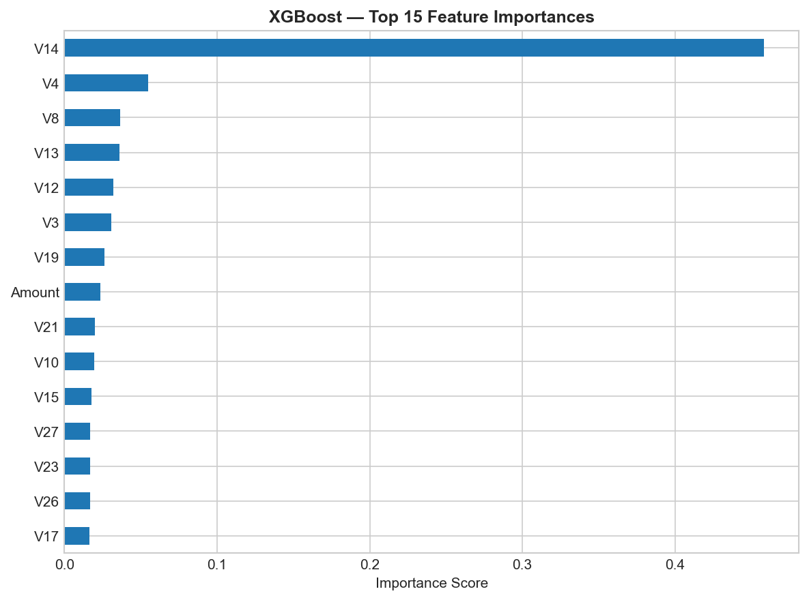

## 🚀 Live Demo

👉 [Click here to try the live app](https://credit-card-fraud-detection-n9uafamqrwtja6zfad6lyg.streamlit.app)

---

# Credit Card Fraud Detection

This project tackles one of the most common and critical problems in the financial industry — detecting fraudulent credit card transactions. Using a real-world dataset from Kaggle, three machine learning models were built and compared to identify fraud accurately on a severely imbalanced dataset where only 0.17% of transactions are fraudulent.

---

## Dataset

The dataset contains 284,807 transactions collected from European cardholders over two days in September 2013. After removing duplicate rows, the final dataset has 283,726 transactions — 283,253 legitimate and 473 fraudulent. All features except Time and Amount have been PCA-transformed to protect cardholder privacy, resulting in 28 anonymised components labelled V1 through V28.

The dataset is sourced from [Kaggle — Credit Card Fraud Detection](https://www.kaggle.com/datasets/mlg-ulb/creditcardfraud).

---

## Problem Statement

The core challenge in this project is not building a model — it is building one that works correctly on severely imbalanced data. A naive model that predicts every transaction as legitimate achieves 99.83% accuracy while catching zero fraud. Standard accuracy is therefore meaningless here. The focus was on maximising fraud detection while keeping false alarms at a manageable level, using Precision, Recall, F1 Score, and ROC AUC as the primary evaluation metrics.

---

## Preprocessing

The raw dataset was first checked for missing values — none were found. Duplicate rows were identified and removed. The Time and Amount columns were scaled using StandardScaler since they operate on a different scale compared to the PCA-transformed features. The dataset was then split into training and testing sets using an 80/20 stratified split to preserve the original class ratio in both sets. All preprocessed arrays and the scaler were saved as pickle files for use across model notebooks.

---

## Models

Three models were trained and evaluated, each chosen for a specific reason. Logistic Regression was used as a baseline model to establish a minimum performance benchmark. Random Forest was chosen as an ensemble method that tends to perform well on structured tabular data. XGBoost was included for its ability to handle class imbalance natively through the scale_pos_weight parameter. Class imbalance was addressed using class_weight='balanced' for Logistic Regression and Random Forest, and scale_pos_weight for XGBoost.

---

## Results

| Model | Accuracy | Precision | Recall | F1 Score | ROC AUC |
|-------|----------|-----------|--------|----------|---------|
| Logistic Regression | 97.58% | 6% | 87% | 11% | 96.55% |
| Random Forest | 99.94% | 89% | 75% | 81% | 96.50% |
| XGBoost | 99.87% | 59% | 80% | 68% | 97.34% |

Logistic Regression catches the highest number of fraud cases with an 87% recall rate but generates a large number of false alarms — legitimate transactions wrongly flagged as fraud. This makes it too noisy for real production use. Random Forest achieves the best balance with 89% precision and an F1 score of 81%, meaning it catches most fraud while keeping false alarms very low. XGBoost achieves the highest ROC AUC of 97.34% and a strong recall of 80% with fewer false alarms than Logistic Regression. For a real-world deployment, Random Forest would be the preferred model based on its F1 score and precision.

---

## Visualisations

### Class Distribution

### Transaction Amount — Fraud vs Legitimate

### Confusion Matrices

### ROC Curves

### Precision-Recall Curves

### Model Performance Comparison

### XGBoost Feature Importance

---

## Key Findings

V14 stands out as by far the most important feature with an importance score of 0.45 — nearly ten times higher than the next feature. This suggests one particular anonymised transaction pattern is the strongest signal for fraud in this dataset. Transaction Amount also appears in the top 15 features, which aligns with real-world fraud behaviour where amount is a natural risk indicator.

Precision-Recall curves were prioritised over ROC-AUC for model evaluation because ROC can appear artificially strong on imbalanced datasets. The Precision-Recall AUC gives a more honest assessment of how well each model identifies the minority fraud class specifically.